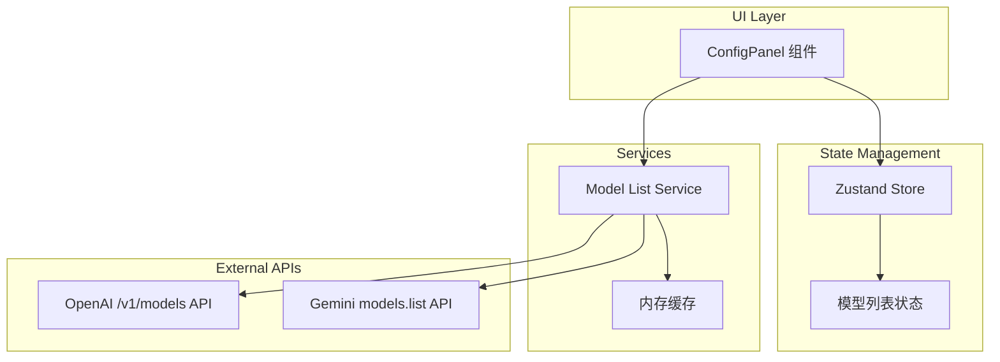

# Design Document: Dynamic Model List

## Overview

当前应用的模型列表是硬编码的，本功能将实现动态从 API 获取可用模型列表。当用户配置了 API Key 和选择了 API 风格后，系统会自动请求对应 API 的模型列表端点，获取用户实际可用的模型。

### 技术方案

- 新增 `modelListService.ts` 服务，负责获取和缓存模型列表
- 扩展 Zustand Store，添加模型列表相关状态
- 修改 `ConfigPanel` 组件，支持动态模型列表和加载状态

## Architecture



## Components and Interfaces

### 1. Model List Service

```typescript
// services/modelListService.ts

interface ModelInfo {
  id: string;           // 模型 ID，用于 API 调用
  name: string;         // 显示名称
  description?: string; // 模型描述（可选）
}

interface FetchModelsResult {
  success: boolean;
  models?: ModelInfo[];
  error?: string;
}

interface ModelListService {
  fetchModels(config: APIConfig): Promise<FetchModelsResult>;
  clearCache(): void;
}
```

**缓存策略**:
- 使用 `Map<string, ModelInfo[]>` 缓存模型列表
- 缓存 key 格式: `${style}:${apiKey}:${baseUrl}`
- 缓存有效期: 5 分钟
- 配置变更时自动清除相关缓存

### 2. Gemini Models API 适配器

```typescript
// Gemini models.list API 响应格式
interface GeminiModelsResponse {
  models: Array<{
    name: string;                    // 格式: "models/gemini-1.5-pro"
    displayName: string;
    description: string;
    supportedGenerationMethods: string[];  // 包含 "generateContent" 等
  }>;
}

// API 端点
// 默认: https://generativelanguage.googleapis.com/v1beta/models
// 自定义: {baseUrl}/v1beta/models
```

**过滤逻辑**:
- 只返回 `supportedGenerationMethods` 包含 `generateContent` 的模型
- 提取模型 ID（去除 "models/" 前缀）

### 3. OpenAI Models API 适配器

```typescript
// OpenAI /v1/models API 响应格式
interface OpenAIModelsResponse {
  data: Array<{
    id: string;
    object: string;
    created: number;
    owned_by: string;
  }>;
  has_more?: boolean;  // 分页标识
}

// API 端点
// 默认: https://api.openai.com/v1/models
// 自定义: {baseUrl}/v1/models
```

**过滤逻辑**:
- 返回所有模型（OpenAI API 不提供能力过滤）
- 按模型 ID 字母排序

### 4. Store 扩展

```typescript
// store/useAppStore.ts 新增状态

interface ModelListState {
  // 模型列表
  availableModels: ModelInfo[];
  isLoadingModels: boolean;
  modelListError: string | null;
  
  // Actions
  setAvailableModels: (models: ModelInfo[]) => void;
  setIsLoadingModels: (loading: boolean) => void;
  setModelListError: (error: string | null) => void;
  fetchModelList: () => Promise<void>;
}
```

### 5. ConfigPanel 组件更新

```typescript
// components/ConfigPanel.tsx 更新

// 新增 UI 元素:
// 1. 模型下拉框旁的刷新按钮
// 2. 加载状态指示器
// 3. 错误提示信息

// 触发获取模型列表的时机:
// 1. API Key 变更后（防抖 500ms）
// 2. API 风格变更后
// 3. Base URL 变更后（防抖 500ms）
// 4. 用户点击刷新按钮
```

## Data Models

### 缓存数据结构

```typescript
interface CacheEntry {
  models: ModelInfo[];
  timestamp: number;  // 缓存时间戳
}

// 缓存 Map
const modelCache = new Map<string, CacheEntry>();

// 缓存有效期（毫秒）
const CACHE_TTL = 5 * 60 * 1000; // 5 分钟
```

### 默认模型列表

```typescript
// 当无法获取模型列表时的回退选项
const DEFAULT_GEMINI_MODELS: ModelInfo[] = [
  { id: 'gemini-2.0-flash-exp', name: 'Gemini 2.0 Flash (Experimental)' },
  { id: 'gemini-1.5-pro', name: 'Gemini 1.5 Pro' },
  { id: 'gemini-1.5-flash', name: 'Gemini 1.5 Flash' },
];

const DEFAULT_OPENAI_MODELS: ModelInfo[] = [
  { id: 'gpt-4o', name: 'GPT-4o' },
  { id: 'gpt-4o-mini', name: 'GPT-4o Mini' },
  { id: 'gpt-4-turbo', name: 'GPT-4 Turbo' },
  { id: 'dall-e-3', name: 'DALL-E 3' },
];
```

## Correctness Properties

*A property is a characteristic or behavior that should hold true across all valid executions of a system—essentially, a formal statement about what the system should do. Properties serve as the bridge between human-readable specifications and machine-verifiable correctness guarantees.*

### Property 1: Config Change Triggers Fetch

*For any* API configuration change (apiKey, style, or baseUrl), if the apiKey is non-empty, the Model_List_Fetcher should trigger a new fetch request with the updated configuration.

**Validates: Requirements 1.1, 1.5, 1.6, 1.8**

### Property 2: Fetch Success Updates Models

*For any* successful API response containing a list of models, the availableModels state should be updated to contain exactly those models (after filtering for Gemini).

**Validates: Requirements 1.3**

### Property 3: Fetch Failure Fallback

*For any* failed API request (network error, invalid response, etc.), the system should fall back to the default preset model list and set an error message.

**Validates: Requirements 1.4**

### Property 4: Cache Prevents Duplicate Requests

*For any* sequence of fetch requests with identical configuration (apiKey, style, baseUrl), only the first request should hit the API; subsequent requests within the cache TTL should return cached results.

**Validates: Requirements 1.7**

### Property 5: URL Construction

*For any* base URL (including empty string for default), the constructed models endpoint URL should be valid and follow the pattern: `{baseUrl}/v1beta/models` for Gemini or `{baseUrl}/v1/models` for OpenAI.

**Validates: Requirements 2.3, 3.3**

### Property 6: Gemini Model Filtering

*For any* Gemini API response, only models with `supportedGenerationMethods` containing `generateContent` should be included in the result.

**Validates: Requirements 2.2**

### Property 7: Model Selection Preservation

*For any* model list update, if the previously selected model exists in the new list, it should remain selected; otherwise, the first model in the new list should be selected.

**Validates: Requirements 4.2, 4.3**

### Property 8: Empty API Key Behavior

*For any* configuration with an empty API Key, no fetch request should be made, and the default preset model list should be displayed.

**Validates: Requirements 4.5**

## Error Handling

| Error Type | User Message | Recovery Action |
|------------|--------------|-----------------|
| Invalid API Key | "API Key 无效，无法获取模型列表" | 显示默认模型列表 |
| Network Error | "网络错误，无法获取模型列表" | 显示默认模型列表 + 刷新按钮 |
| Rate Limit | "请求过于频繁，请稍后再试" | 显示默认模型列表 + 刷新按钮 |
| Invalid Response | "API 返回了无效的响应" | 显示默认模型列表 |
| Timeout | "请求超时" | 显示默认模型列表 + 刷新按钮 |

## Testing Strategy

### Unit Tests

使用 Vitest 进行单元测试：

1. **modelListService**: 测试 URL 构建、响应解析、缓存逻辑
2. **ConfigPanel**: 测试加载状态、错误显示、模型选择

### Property-Based Tests

使用 fast-check 进行属性测试，每个属性测试运行至少 100 次迭代：

1. **URL Construction**: 生成随机 base URL，验证端点构建正确性
2. **Model Filtering**: 生成随机模型列表，验证过滤逻辑
3. **Cache Behavior**: 生成随机配置序列，验证缓存命中

### Test Configuration

```typescript
// Property Test Annotation Format
// Feature: dynamic-model-list, Property N: {property_text}
// Validates: Requirements X.Y
```

