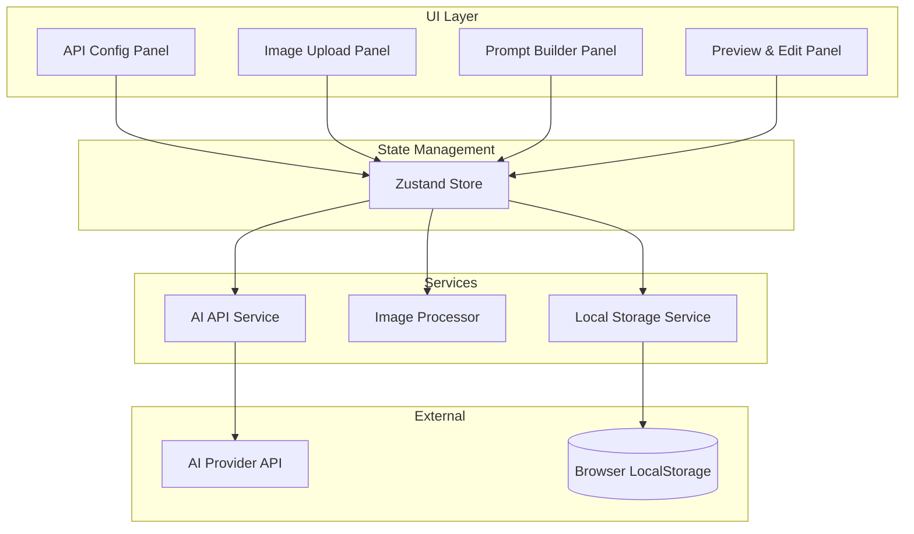
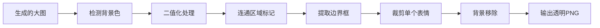

# Design Document: Emoji Pack Generator

## Overview

这是一个纯前端的 AI 表情包生成应用，使用 React + TypeScript 构建。用户可以配置 AI API、上传参考图片、输入提示词，然后 AI 生成包含多个表情的大图。系统自动检测并分割出单个表情，用户还可以对单个表情进行二次编辑。

### 技术栈选择

- **框架**: React 18 + TypeScript
- **构建工具**: Vite
- **样式**: Tailwind CSS
- **状态管理**: Zustand（轻量级，适合中小型应用）
- **图片处理**: Canvas API + @imgly/background-removal
- **文件打包**: JSZip（用于批量下载）

## Architecture



## Components and Interfaces

### 1. API Configuration Module

```typescript
// types/api.ts
type APIStyle = 'gemini' | 'openai';

interface APIConfig {
  apiKey: string;
  baseUrl: string;
  style: APIStyle;
  model?: string;
}

// services/apiService.ts
interface AIAPIService {
  generateImage(prompt: string, images: ImageData[]): Promise<Blob>;
  validateConfig(config: APIConfig): Promise<boolean>;
}
```

**设计决策**: 
- 使用适配器模式支持 Gemini 和 OpenAI 两种 API 风格
- Gemini 使用 `@google/generative-ai` SDK
- OpenAI 风格使用标准 fetch 请求

### 2. Image Upload Module

```typescript
// types/image.ts
interface UploadedImage {
  id: string;
  file: File;
  preview: string;  // base64 或 object URL
  type: 'material' | 'reference';
}

interface ImageUploadState {
  materialImages: UploadedImage[];  // 最多 21 张
  referenceImages: UploadedImage[]; // 最多 3 张
}

// components/ImageUploader.tsx
interface ImageUploaderProps {
  type: 'material' | 'reference';
  maxCount: number;
  images: UploadedImage[];
  onUpload: (files: File[]) => void;
  onRemove: (id: string) => void;
}
```

### 3. Prompt Builder Module

```typescript
// types/prompt.ts
interface PromptConfig {
  languagePreference: string;
  userPrompt: string;
}

// services/promptBuilder.ts
interface PromptBuilder {
  buildSystemPrompt(): string;
  buildFullPrompt(config: PromptConfig): string;
}
```

**系统提示词策略**:
```
你是一个表情包设计师。请根据用户提供的素材图和基准图，生成一系列表情包。

要求：
1. 生成的图片必须是纯色背景（推荐白色或浅灰色）
2. 在一张大图中生成多个表情（建议 3x3 或 4x4 网格排列）
3. 每个表情之间要有明显的间隔
4. 表情风格要参考用户提供的基准图
5. 表情内容要参考用户提供的素材图中的形象
{languagePreference}
{userPrompt}
```

### 4. Image Splitter Module

```typescript
// services/imageSplitter.ts
interface BoundingBox {
  x: number;
  y: number;
  width: number;
  height: number;
}

interface ExtractedEmoji {
  id: string;
  imageData: ImageData;
  blob: Blob;
  preview: string;
  boundingBox: BoundingBox;
}

interface ImageSplitter {
  detectEmojis(image: HTMLImageElement): Promise<BoundingBox[]>;
  extractEmoji(image: HTMLImageElement, box: BoundingBox): Promise<ExtractedEmoji>;
  removeBackground(imageBlob: Blob): Promise<Blob>;
}
```

**分割算法设计**:

1. **背景色检测**: 采样图片四角像素，确定背景色
2. **连通区域检测**: 使用 Flood Fill 算法标记非背景区域
3. **边界框提取**: 计算每个连通区域的最小边界框
4. **单独裁剪**: 根据边界框裁剪出单个表情
5. **背景移除**: 使用 `@imgly/background-removal` 移除残留背景



### 5. Emoji Editor Module

```typescript
// types/editor.ts
interface EditorState {
  selectedEmojiId: string | null;
  editPrompt: string;
  isEditing: boolean;
}

// components/EmojiEditor.tsx
interface EmojiEditorProps {
  emoji: ExtractedEmoji;
  onRegenerate: (prompt: string) => Promise<void>;
  onDownload: () => void;
}
```

### 6. State Management (Zustand Store)

```typescript
// store/useAppStore.ts
interface AppState {
  // API Config
  apiConfig: APIConfig;
  setAPIConfig: (config: Partial<APIConfig>) => void;
  
  // Language Preference
  languagePreference: string;
  setLanguagePreference: (pref: string) => void;
  
  // Images
  materialImages: UploadedImage[];
  referenceImages: UploadedImage[];
  addMaterialImage: (file: File) => void;
  addReferenceImage: (file: File) => void;
  removeImage: (id: string, type: 'material' | 'reference') => void;
  
  // Prompt
  userPrompt: string;
  setUserPrompt: (prompt: string) => void;
  
  // Generation
  isGenerating: boolean;
  generatedImage: Blob | null;
  extractedEmojis: ExtractedEmoji[];
  generate: () => Promise<void>;
  
  // Editor
  selectedEmojiId: string | null;
  selectEmoji: (id: string | null) => void;
  regenerateEmoji: (id: string, prompt: string) => Promise<void>;
}
```

## Data Models

### LocalStorage Schema

```typescript
// 存储在 localStorage 中的数据结构
interface PersistedState {
  apiConfig: {
    apiKey: string;      // 加密存储
    baseUrl: string;
    style: APIStyle;
    model?: string;
  };
  languagePreference: string;
}

const STORAGE_KEY = 'emoji-pack-generator-config';
```

### Image Processing Pipeline

```typescript
// 图片处理流水线数据流
interface ProcessingPipeline {
  input: {
    generatedImage: Blob;
    backgroundColor?: string;
  };
  
  detection: {
    binaryMask: ImageData;
    labels: number[][];  // 连通区域标签矩阵
    boundingBoxes: BoundingBox[];
  };
  
  extraction: {
    croppedImages: Blob[];
    transparentImages: Blob[];  // 背景移除后
  };
  
  output: ExtractedEmoji[];
}
```

## Correctness Properties

*A property is a characteristic or behavior that should hold true across all valid executions of a system—essentially, a formal statement about what the system should do. Properties serve as the bridge between human-readable specifications and machine-verifiable correctness guarantees.*

### Property 1: Config Persistence Round Trip

*For any* valid API configuration (apiKey, baseUrl, style, languagePreference), saving to localStorage then loading should return an equivalent configuration object.

**Validates: Requirements 1.4, 1.5, 2.3**

### Property 2: API Config Validation

*For any* API configuration input, if the apiKey is empty or the baseUrl is not a valid URL format, validation should reject the input and return an error.

**Validates: Requirements 1.6**

### Property 3: Prompt Composition

*For any* combination of language preference string and user prompt string, the final generated prompt should contain both the language preference and the user prompt as substrings.

**Validates: Requirements 2.2, 4.3**

### Property 4: Image Upload Limits

*For any* number N of material images where N <= 21, upload should succeed and the image count should equal N. *For any* number M of material images where M > 21, only the first 21 should be accepted. The same applies to reference images with limit 3.

**Validates: Requirements 3.1, 3.2, 3.3**

### Property 5: Image Upload and Remove Consistency

*For any* sequence of upload and remove operations on images, the final count should equal (total uploads - total removes), bounded by 0 and the maximum limit.

**Validates: Requirements 3.4, 3.5**

### Property 6: Supported Image Formats

*For any* file with extension in {png, jpg, jpeg, webp} (case-insensitive), the Image_Uploader should accept the file. *For any* file with extension not in this set, the uploader should reject it.

**Validates: Requirements 3.6**

### Property 7: Error Message Display

*For any* API error response, the system should display a non-empty, user-friendly error message (not raw error codes or stack traces).

**Validates: Requirements 5.4**

### Property 8: Emoji Detection on Solid Background

*For any* image containing N distinct non-background colored regions on a solid color background (where regions are separated by background color), the Image_Splitter should detect exactly N bounding boxes.

**Validates: Requirements 6.1**

### Property 9: Background Removal Transparency

*For any* extracted emoji image, pixels that were part of the solid background color should have alpha value of 0 (fully transparent) in the output.

**Validates: Requirements 6.2, 6.3**

### Property 10: Download Output Format

*For any* downloaded emoji, the file should be in PNG format with alpha channel support. *For any* batch download, the ZIP archive should contain exactly the same number of files as extracted emojis.

**Validates: Requirements 8.1, 8.2, 8.3**

## Error Handling

### API Errors

| Error Type | User Message | Recovery Action |
|------------|--------------|-----------------|
| Invalid API Key | "API Key 无效，请检查配置" | 引导用户到配置面板 |
| Rate Limit | "请求过于频繁，请稍后再试" | 显示倒计时，自动重试 |
| Network Error | "网络连接失败，请检查网络" | 提供重试按钮 |
| Timeout | "请求超时，请重试" | 提供重试按钮 |
| Invalid Response | "AI 返回了无效的响应" | 提供重试按钮 |

### Image Processing Errors

| Error Type | User Message | Recovery Action |
|------------|--------------|-----------------|
| Invalid Format | "不支持的图片格式" | 提示支持的格式列表 |
| File Too Large | "图片文件过大（最大 10MB）" | 建议压缩图片 |
| Detection Failed | "未能检测到表情包，请确保图片背景为纯色" | 提供手动分割选项 |
| Background Removal Failed | "背景移除失败" | 提供原图下载选项 |

## Testing Strategy

### Unit Tests

使用 Vitest 进行单元测试，重点覆盖：

1. **API Service**: 测试请求构建、响应解析、错误处理
2. **Prompt Builder**: 测试提示词组合逻辑
3. **Image Splitter**: 测试连通区域检测算法
4. **Storage Service**: 测试 localStorage 读写

### Property-Based Tests

使用 fast-check 进行属性测试，每个属性测试运行至少 100 次迭代：

1. **Config Round Trip**: 生成随机配置，验证存储后读取一致性
2. **Image Upload Limits**: 生成随机数量的图片，验证限制逻辑
3. **Prompt Composition**: 生成随机字符串，验证组合结果

### Integration Tests

使用 Playwright 进行端到端测试：

1. 完整的配置 → 上传 → 生成 → 分割 → 下载流程
2. 错误场景处理
3. 状态持久化验证

### Test Configuration

```typescript
// vitest.config.ts
export default defineConfig({
  test: {
    environment: 'jsdom',
    coverage: {
      provider: 'v8',
      reporter: ['text', 'html'],
    },
  },
});
```

**Property Test Annotation Format**:
```typescript
// Feature: emoji-pack-generator, Property 1: Config Persistence Round Trip
// Validates: Requirements 1.4, 1.5, 2.3
test.prop([fc.record({...})])('config round trip', (config) => {
  // test implementation
});
```

