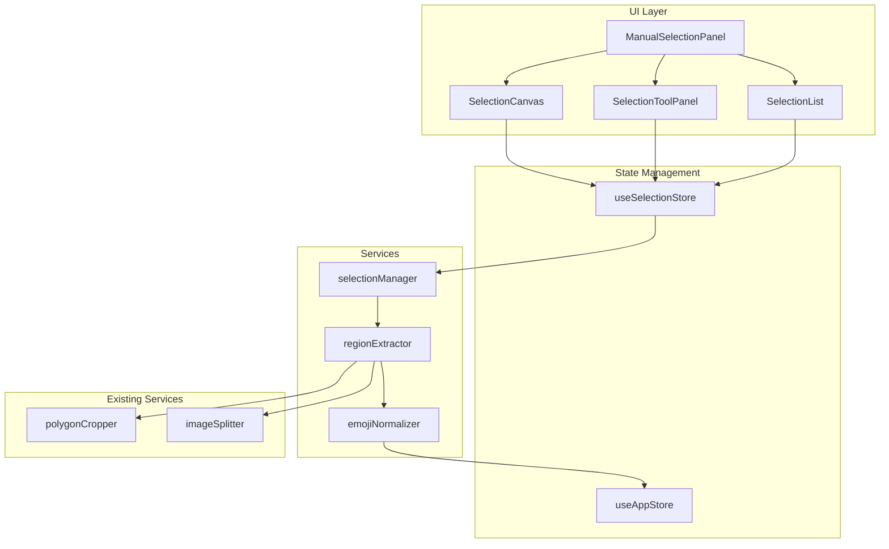

# Design Document: Manual Region Selection

## Overview

本设计文档描述了手动框选切割功能的技术实现方案。该功能允许用户在上传的图片上直接绘制选区（矩形或多边形），系统将提取选区内容、移除背景，并标准化为 240×240 像素的表情包。

核心设计原则：
- **复用现有基础设施**：利用已有的 `polygonCropper`、`imageSplitter` 服务和类型定义
- **组件化设计**：将画布交互、选区管理、提取处理分离为独立模块
- **响应式交互**：提供流畅的绘制体验和即时视觉反馈
- **无缝集成**：提取的表情包与现有工作流完全兼容

## Architecture



## Components and Interfaces

### 1. ManualSelectionPanel Component

主容器组件，整合画布、工具面板和选区列表。

```typescript
interface ManualSelectionPanelProps {
  /** 要处理的图片文件 */
  imageFile: File;
  /** 提取完成回调 */
  onExtractComplete?: (emojis: ExtractedEmoji[]) => void;
  /** 取消回调 */
  onCancel?: () => void;
}

// 组件结构
function ManualSelectionPanel({ imageFile, onExtractComplete, onCancel }: ManualSelectionPanelProps) {
  // 加载图片到 canvas
  // 渲染 SelectionCanvas + SelectionToolPanel + SelectionList
  // 处理提取逻辑
}
```

### 2. SelectionCanvas Component

交互式画布组件，处理所有绘制和编辑操作。

```typescript
interface SelectionCanvasProps {
  /** 图片元素 */
  image: HTMLImageElement;
  /** 当前选区列表 */
  selections: SelectionRegion[];
  /** 当前绘制模式 */
  mode: SelectionMode;
  /** 当前活动选区 ID */
  activeSelectionId: string | null;
  /** 选区变更回调 */
  onSelectionsChange: (selections: SelectionRegion[]) => void;
  /** 活动选区变更回调 */
  onActiveSelectionChange: (id: string | null) => void;
}

type SelectionMode = 'rectangle' | 'polygon' | 'select';

interface CanvasState {
  /** 缩放级别 */
  zoom: number;
  /** 平移偏移 */
  offset: { x: number; y: number };
  /** 是否正在绘制 */
  isDrawing: boolean;
  /** 当前绘制中的选区 */
  drawingSelection: Partial<SelectionRegion> | null;
}
```

### 3. SelectionToolPanel Component

工具面板组件，提供模式切换和操作按钮。

```typescript
interface SelectionToolPanelProps {
  /** 当前模式 */
  mode: SelectionMode;
  /** 选区数量 */
  selectionCount: number;
  /** 是否正在提取 */
  isExtracting: boolean;
  /** 模式变更回调 */
  onModeChange: (mode: SelectionMode) => void;
  /** 提取回调 */
  onExtract: () => void;
  /** 清空回调 */
  onClearAll: () => void;
  /** 撤销回调 */
  onUndo: () => void;
}
```

### 4. SelectionList Component

选区列表组件，显示所有选区的缩略图和操作。

```typescript
interface SelectionListProps {
  /** 选区列表 */
  selections: SelectionRegion[];
  /** 活动选区 ID */
  activeSelectionId: string | null;
  /** 图片数据（用于生成缩略图） */
  imageData: ImageData;
  /** 选区点击回调 */
  onSelectionClick: (id: string) => void;
  /** 删除回调 */
  onDelete: (id: string) => void;
}
```

## Data Models

### SelectionRegion

扩展现有的 `SegmentationRegion` 类型，添加选区特有的属性。

```typescript
import type { Point, Polygon, BoundingBox } from '../types/segmentation';

/**
 * 选区类型
 */
export type SelectionType = 'rectangle' | 'polygon';

/**
 * 选区区域
 */
export interface SelectionRegion {
  /** 唯一标识 */
  id: string;
  /** 选区类型 */
  type: SelectionType;
  /** 边界框（始终存在，用于快速定位和矩形选区） */
  boundingBox: BoundingBox;
  /** 多边形顶点（仅多边形类型） */
  polygon?: Polygon;
  /** 创建时间戳 */
  createdAt: number;
  /** 是否被选中 */
  isSelected?: boolean;
}

/**
 * 选区操作历史记录
 */
export interface SelectionAction {
  type: 'add' | 'remove' | 'modify' | 'clear';
  /** 操作前的选区状态（用于撤销） */
  previousState: SelectionRegion[];
  /** 操作后的选区状态 */
  newState: SelectionRegion[];
  timestamp: number;
}

/**
 * 选区 Store 状态
 */
export interface SelectionState {
  /** 所有选区 */
  selections: SelectionRegion[];
  /** 当前活动选区 ID */
  activeSelectionId: string | null;
  /** 当前绘制模式 */
  mode: SelectionMode;
  /** 操作历史（用于撤销） */
  history: SelectionAction[];
  /** 历史指针 */
  historyIndex: number;
}
```

### Extraction Options

```typescript
/**
 * 提取配置选项
 */
export interface ExtractionOptions {
  /** 是否移除背景 */
  removeBackground: boolean;
  /** 背景移除容差 */
  backgroundTolerance: number;
  /** 输出尺寸 */
  outputSize: number;
  /** 是否使用高质量缩放 */
  highQualityResize: boolean;
}

const DEFAULT_EXTRACTION_OPTIONS: ExtractionOptions = {
  removeBackground: true,
  backgroundTolerance: 30,
  outputSize: 240,
  highQualityResize: true,
};
```

## Correctness Properties

*A property is a characteristic or behavior that should hold true across all valid executions of a system—essentially, a formal statement about what the system should do. Properties serve as the bridge between human-readable specifications and machine-verifiable correctness guarantees.*

### Property 1: Rectangle Selection Bounds Validity

*For any* rectangle selection created by dragging from point A to point B on an image of dimensions W×H, the resulting boundingBox SHALL have:
- Positive width and height (width > 0, height > 0)
- Coordinates within image boundaries (0 ≤ x < W, 0 ≤ y < H, x + width ≤ W, y + height ≤ H)

**Validates: Requirements 2.1, 2.3**

### Property 2: Rectangle Resize Preserves Validity

*For any* existing rectangle selection and any resize operation (dragging corner or edge handles), the resulting boundingBox SHALL remain valid (positive dimensions, within image bounds).

**Validates: Requirements 2.4**

### Property 3: Rectangle Move Preserves Size

*For any* rectangle selection with dimensions W×H, after any move operation (dragging interior), the resulting boundingBox SHALL have the same width W and height H.

**Validates: Requirements 2.5**

### Property 4: Polygon Closure Consistency

*For any* completed polygon selection, the polygon SHALL have at least 3 vertices, forming a closed shape where the path from the last vertex connects back to the first vertex.

**Validates: Requirements 3.1, 3.3**

### Property 5: Polygon Non-Self-Intersection

*For any* valid polygon selection with N vertices, no two non-adjacent edges (edges that don't share a vertex) SHALL intersect each other.

**Validates: Requirements 3.6**

### Property 6: Polygon Vertex Edit Isolation

*For any* polygon selection and any single vertex drag operation, only the dragged vertex position SHALL change; all other vertices SHALL remain at their original positions.

**Validates: Requirements 3.4**

### Property 7: Polygon Edge Vertex Insertion

*For any* polygon selection with N vertices, clicking on an edge to add a new vertex SHALL result in a polygon with N+1 vertices, where the new vertex lies on the original edge.

**Validates: Requirements 3.5**

### Property 8: Selection ID Uniqueness

*For any* set of selections in the selection list at any point in time, all selection IDs SHALL be unique (no two selections share the same ID).

**Validates: Requirements 4.1, 4.2**

### Property 9: Keyboard Deletion Removes Active Selection

*For any* active selection in the selection list, pressing Delete or Backspace key SHALL remove exactly that selection from the list, leaving all other selections unchanged.

**Validates: Requirements 4.4, 8.5**

### Property 10: Undo State Consistency

*For any* sequence of N selection operations (add, remove, modify) followed by M undo operations (where M ≤ N), the selection state SHALL exactly match the state after the first (N - M) operations.

**Validates: Requirements 7.4, 8.4**

### Property 11: Output Size Normalization

*For any* extracted emoji from a selection region of any dimensions, the output image SHALL be exactly 240×240 pixels, with the original content scaled to fit while maintaining aspect ratio.

**Validates: Requirements 6.1, 6.5**

### Property 12: Centering and Transparency

*For any* extracted emoji where the scaled content does not fill the entire 240×240 canvas, the content SHALL be centered, and all padding pixels SHALL have alpha value of 0 (fully transparent).

**Validates: Requirements 6.2, 6.3**

### Property 13: Polygon Masking Correctness

*For any* polygon selection extraction and any pixel coordinate (x, y), if the pixel is outside the polygon boundary (as determined by point-in-polygon test), its alpha value SHALL be 0 (fully transparent).

**Validates: Requirements 5.2**

### Property 14: Selection Coordinate Transformation

*For any* selection drawn on a canvas with zoom level Z and pan offset (Ox, Oy), the stored selection coordinates SHALL correctly map to the original image coordinate space using the inverse transformation.

**Validates: Requirements 1.3, 2.1, 3.1**

### Property 15: Aspect Ratio Preservation on Canvas

*For any* image with dimensions W×H displayed on a canvas, the displayed aspect ratio (displayW / displayH) SHALL equal the original aspect ratio (W / H) within a tolerance of 0.01.

**Validates: Requirements 1.2**

### Property 16: Store Integration Data Structure

*For any* emoji extracted via manual selection, it SHALL have all required fields: id (non-empty string), blob (valid Blob), preview (valid data URL or object URL), and boundingBox (valid BoundingBox with positive dimensions).

**Validates: Requirements 10.2**

### Property 17: Store Update on Extraction

*For any* manual selection extraction that produces N emojis, the extractedEmojis array in the store SHALL increase by exactly N items.

**Validates: Requirements 10.1**

### Property 18: Selection Count Display Accuracy

*For any* number of selections N in the selection list, the displayed count in the tool panel SHALL equal N.

**Validates: Requirements 7.6**

### Property 19: Multi-Selection via Shift+Click

*For any* sequence of Shift+Click operations on K different selections, exactly those K selections SHALL be marked as selected (isSelected = true).

**Validates: Requirements 4.6**

### Property 20: Escape Cancels In-Progress Selection

*For any* in-progress selection (drawing state), pressing Escape SHALL clear the drawing state without adding any new selection to the list.

**Validates: Requirements 8.3**

## Error Handling

### Canvas Errors

| Error Scenario | Handling Strategy |
|----------------|-------------------|
| Image load failure | Display error message, offer retry option |
| Canvas context unavailable | Fall back to basic image display, disable drawing |
| Out of memory (large image) | Automatically downsample image, warn user |

### Selection Errors

| Error Scenario | Handling Strategy |
|----------------|-------------------|
| Self-intersecting polygon | Highlight invalid edges, prevent completion |
| Selection outside image bounds | Clamp coordinates to image boundaries |
| Empty selection (zero area) | Prevent creation, show warning |

### Extraction Errors

| Error Scenario | Handling Strategy |
|----------------|-------------------|
| Background removal failure | Return original cropped image with warning |
| Resize failure | Return original size with warning |
| Memory exhaustion | Process selections in batches |

### Error Message Format

```typescript
interface SelectionError {
  code: 'INVALID_POLYGON' | 'OUT_OF_BOUNDS' | 'EXTRACTION_FAILED' | 'MEMORY_ERROR';
  message: string;
  selectionId?: string;
  recoverable: boolean;
}
```

## Testing Strategy

### Unit Tests

单元测试覆盖核心逻辑函数和边缘情况：

1. **Geometry Utilities**
   - `isPointInPolygon` - 点在多边形内判断（边界情况、凹多边形）
   - `isPolygonSelfIntersecting` - 多边形自相交检测
   - `calculateBoundingBox` - 边界框计算
   - `normalizeCoordinates` - 坐标归一化（缩放、平移变换）
   - `doEdgesIntersect` - 边相交检测

2. **Selection Manager**
   - `createRectangleSelection` - 矩形选区创建（正常、边界情况）
   - `createPolygonSelection` - 多边形选区创建（最小顶点数验证）
   - `updateSelection` - 选区更新（移动、调整大小）
   - `deleteSelection` - 选区删除
   - `undoAction` / `redoAction` - 撤销/重做操作

3. **Region Extractor**
   - `extractRegion` - 区域提取（矩形、多边形）
   - `applyPolygonMask` - 多边形遮罩应用
   - 错误处理：无效选区、超出边界

4. **Emoji Normalizer**
   - `normalizeToSize` - 尺寸标准化（放大、缩小情况）
   - `centerInCanvas` - 居中处理
   - 透明度填充验证

### Property-Based Tests

使用 fast-check 进行属性测试，每个测试至少运行 100 次迭代：

| Property | Test Description | Generator Strategy |
|----------|------------------|-------------------|
| Property 1 | Rectangle bounds validity | Random start/end points within image bounds |
| Property 2 | Rectangle resize preserves validity | Random rectangle + random resize delta |
| Property 3 | Rectangle move preserves size | Random rectangle + random move delta |
| Property 4 | Polygon closure consistency | Random vertex arrays (3-10 vertices) |
| Property 5 | Polygon non-self-intersection | Random convex/concave polygons |
| Property 6 | Polygon vertex edit isolation | Random polygon + random vertex index + delta |
| Property 7 | Polygon edge vertex insertion | Random polygon + random edge index |
| Property 8 | Selection ID uniqueness | Random sequences of add operations |
| Property 9 | Keyboard deletion | Random selection list + random active index |
| Property 10 | Undo state consistency | Random operation sequences |
| Property 11 | Output size normalization | Random input dimensions |
| Property 12 | Centering and transparency | Random non-square input dimensions |
| Property 13 | Polygon masking correctness | Random polygon + random test points |
| Property 14 | Coordinate transformation | Random zoom/pan + random coordinates |
| Property 15 | Aspect ratio preservation | Random image dimensions |
| Property 16 | Store integration data structure | Random extraction results |
| Property 17 | Store update on extraction | Random selection counts |
| Property 18 | Selection count display | Random add/remove sequences |
| Property 19 | Multi-selection via Shift+Click | Random click sequences |
| Property 20 | Escape cancels in-progress | Random drawing states |

### Integration Tests

1. **End-to-end selection flow**: Upload → Draw → Extract → View in grid
2. **Keyboard shortcuts**: Test all shortcut combinations (R, P, Escape, Delete, Ctrl+Z)
3. **Multi-selection operations**: Create, select, delete multiple selections
4. **Zoom/pan interactions**: Draw selections at various zoom levels
5. **Error recovery**: Test behavior when extraction fails

### Test Configuration

```typescript
// vitest.config.ts additions
export default defineConfig({
  test: {
    // Property-based tests need more iterations
    testTimeout: 30000,
  },
});

// fast-check configuration in test files
import fc from 'fast-check';

// Run each property test with at least 100 iterations
fc.configureGlobal({ numRuns: 100 });
```

### Test File Organization

```
src/
├── services/
│   ├── selectionManager.ts
│   ├── selectionManager.test.ts        # Unit tests
│   ├── selectionManager.property.test.ts # Property tests
│   ├── regionExtractor.ts
│   ├── regionExtractor.test.ts
│   ├── regionExtractor.property.test.ts
│   ├── emojiNormalizer.ts
│   ├── emojiNormalizer.test.ts
│   └── emojiNormalizer.property.test.ts
└── utils/
    ├── geometry.ts
    ├── geometry.test.ts
    └── geometry.property.test.ts
```
