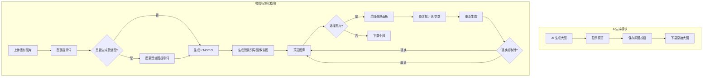
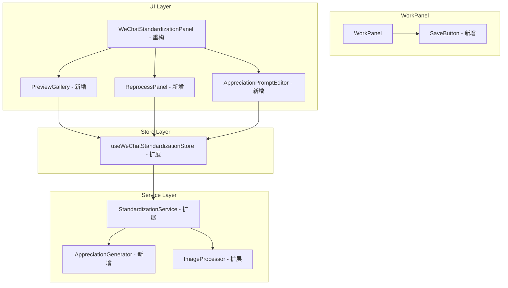

# Design Document: WeChat Standardization Enhancement

## Overview

本设计文档描述微信表情标准化功能的四项增强：
1. AI 生成大图保存功能
2. 赞赏图生成选项（赞赏引导图 + 赞赏致谢图）
3. P1/P2/P3 提示词优化
4. 页面布局重设计（图片选择和单独处理功能）

### 核心流程



### 微信表情平台规范（扩展）

| 类型 | 名称 | 尺寸 | 格式 | 背景 | 大小限制 |
|------|------|------|------|------|----------|
| P1 | 详情页横幅 | 750×400 | JPG/PNG | 不透明 | ≤500KB |
| P2 | 表情封面图 | 240×240 | PNG | 透明 | ≤500KB |
| P3 | 聊天页图标 | 50×50 | PNG | 透明 | ≤100KB |
| P4 | 赞赏引导图 | 750×560 | JPG/GIF/PNG | 不透明 | ≤500KB |
| P5 | 赞赏致谢图 | 750×750 | JPG/GIF/PNG | 不透明 | ≤500KB |

## Architecture

### 模块架构（更新）



## Components and Interfaces

### 1. SaveButton（新增）

AI 生成大图保存按钮组件。

```typescript
interface SaveButtonProps {
  /** 要保存的图片 Blob */
  imageBlob: Blob | null;
  /** 文件名前缀 */
  filenamePrefix?: string;
  /** 是否禁用 */
  disabled?: boolean;
}
```

### 2. PreviewGallery（新增）

已生成图片的预览图库组件，支持选择图片。

```typescript
interface PreviewGalleryProps {
  /** P1 横幅预览 */
  banner: ProcessedImage | null;
  /** P2 封面预览 */
  cover: ProcessedImage | null;
  /** P3 图标预览 */
  icon: ProcessedImage | null;
  /** P4 赞赏引导图预览 */
  appreciationGuide: ProcessedImage | null;
  /** P5 赞赏致谢图预览 */
  appreciationThanks: ProcessedImage | null;
  /** 当前选中的图片类型 */
  selectedType: ImageType | null;
  /** 选择回调 */
  onSelect: (type: ImageType) => void;
}

type ImageType = 'banner' | 'cover' | 'icon' | 'appreciationGuide' | 'appreciationThanks';
```

### 3. ReprocessPanel（新增）

单独处理面板组件，用于对选中的图片进行重新生成。

```typescript
interface ReprocessPanelProps {
  /** 选中的图片类型 */
  selectedType: ImageType;
  /** 原始图片 */
  originalImage: ProcessedImage;
  /** 新生成的图片（用于对比） */
  newImage: ProcessedImage | null;
  /** 当前提示词 */
  prompt: string;
  /** 提示词变更回调 */
  onPromptChange: (value: string) => void;
  /** 切割参数 */
  processingParams: ProcessingParams;
  /** 参数变更回调 */
  onParamsChange: (params: ProcessingParams) => void;
  /** 重新生成回调 */
  onRegenerate: () => void;
  /** 替换回调 */
  onReplace: () => void;
  /** 取消回调 */
  onCancel: () => void;
  /** 是否正在处理 */
  isProcessing: boolean;
}

interface ProcessingParams {
  /** 容差值 */
  tolerance: number;
  /** 最小区域 */
  minArea: number;
  /** 最小尺寸 */
  minSize: number;
}
```

### 4. AppreciationPromptEditor（新增）

赞赏图提示词编辑组件。

```typescript
interface AppreciationPromptEditorProps {
  /** 赞赏引导图提示词 */
  guidePrompt: string;
  /** 赞赏致谢图提示词 */
  thanksPrompt: string;
  /** 提示词变更回调 */
  onPromptChange: (type: 'guide' | 'thanks', value: string) => void;
  /** 重置回调 */
  onReset: (type: 'guide' | 'thanks') => void;
  /** 是否启用 */
  enabled: boolean;
}
```

## Data Models

### ProcessedImage（扩展）

```typescript
interface ProcessedImage {
  id: string;
  type: 'banner' | 'cover' | 'icon' | 'appreciationGuide' | 'appreciationThanks';
  blob: Blob;
  preview: string;
  width: number;
  height: number;
  sizeKB: number;
  format: 'png' | 'jpeg' | 'gif';
  hasTransparency: boolean;
}
```

### StandardizationPrompts（扩展）

```typescript
interface StandardizationPrompts {
  p1: string;  // 横幅提示词
  p2: string;  // 封面提示词
  p3: string;  // 图标提示词
  appreciationGuide: string;  // 赞赏引导图提示词（新增）
  appreciationThanks: string; // 赞赏致谢图提示词（新增）
}
```

### StandardizationResult（扩展）

```typescript
interface StandardizationResult {
  banner: ProcessedImage | null;
  cover: ProcessedImage | null;
  icon: ProcessedImage | null;
  appreciationGuide: ProcessedImage | null;  // 新增
  appreciationThanks: ProcessedImage | null; // 新增
  errors: StandardizationError[];
}
```

### WeChatStandardizationState（扩展）

```typescript
interface WeChatStandardizationState {
  // 现有状态...
  
  // 新增状态
  enableAppreciation: boolean;  // 是否启用赞赏图生成
  selectedImageType: ImageType | null;  // 当前选中的图片类型
  reprocessPrompt: string;  // 单独处理的提示词
  reprocessParams: ProcessingParams;  // 单独处理的参数
  reprocessResult: ProcessedImage | null;  // 重新生成的结果
  
  // 新增 Actions
  setEnableAppreciation: (enabled: boolean) => void;
  setSelectedImageType: (type: ImageType | null) => void;
  setReprocessPrompt: (prompt: string) => void;
  setReprocessParams: (params: ProcessingParams) => void;
  regenerateSelected: () => Promise<void>;
  replaceWithReprocessed: () => void;
  cancelReprocess: () => void;
}
```

### 默认提示词（优化）

```typescript
const DEFAULT_PROMPTS: StandardizationPrompts = {
  p1: `基于提供的表情包素材，创作一张微信表情详情页横幅图。
要求：
- 横幅构图（750×400），画面生动有趣、富有故事性
- 展现角色之间的互动或有趣的场景
- 可以使用动态姿势、夸张表情、有趣的情境
- 色调活泼明朗，与微信底色有较大区分
- 避免使用白色背景和纯色背景
- 图中避免出现任何文字信息
- 元素不能因拉伸或压扁导致变形
- 鼓励创意构图，让画面更加吸引眼球`,

  p2: `基于提供的表情包素材，创作一张微信表情封面图。
要求：
- 【重要】只生成单个角色的形象，绝对不要生成多个表情的拼接图或九宫格
- 【重要】不要生成表情包合集、网格排列或多图拼接
- 选取最具辨识度的单一角色形象
- 使用表情形象正面的半身像或全身像
- 避免只使用形象头部图片
- 画面尽量简洁，避免加入装饰元素
- 除纯文字类型表情外，避免出现文字
- 形象不应有白色描边，避免出现锯齿
- 背景需要透明或纯色便于后续处理`,

  p3: `基于提供的表情包素材，创作一张微信聊天页图标。
要求：
- 【重要】只生成单个角色的头部正面图，绝对不要生成多个表情的拼接图或九宫格
- 【重要】不要生成表情包合集、网格排列或多图拼接
- 选最具辨识度和清晰的单一角色头部
- 画面尽量简洁，避免加入装饰元素
- 使用仅含表情角色头部正面图像
- 形象不应有白色描边，避免出现锯齿
- 不要出现正方形边框
- 每张图片不应有过多留白
- 背景需要透明或纯色便于后续处理`,

  appreciationGuide: `基于提供的表情包素材，创作一张微信表情赞赏引导图。
要求：
- 尺寸 750×560 像素
- 用于吸引用户发赞赏，画面要有感染力
- 风格必须与表情包一致
- 可以展示角色做出感谢、期待、可爱的姿势
- 不可出现与表情不相关的内容
- 避免出现文字（除非是表情本身的文字风格）
- 色调温暖友好，让用户产生好感`,

  appreciationThanks: `基于提供的表情包素材，创作一张微信表情赞赏致谢图。
要求：
- 尺寸 750×750 像素
- 用于激发用户分享意愿，画面要有感染力
- 风格必须与表情包一致
- 可以展示角色做出感谢、开心、比心的姿势
- 不可出现与表情不相关的内容
- 避免出现文字（除非是表情本身的文字风格）
- 色调温暖友好，传达感谢之情`,
};
```

### 微信规格常量（扩展）

```typescript
export const WECHAT_SPECS = {
  // 现有规格...
  
  /** P4 赞赏引导图 */
  APPRECIATION_GUIDE: {
    width: 750,
    height: 560,
    maxSizeKB: 500,
    formats: ['png', 'jpeg', 'gif'] as const,
    requiresTransparency: false,
    name: 'appreciationGuide',
    displayName: '赞赏引导图',
    fileName: 'appreciation_guide_750x560',
  },
  /** P5 赞赏致谢图 */
  APPRECIATION_THANKS: {
    width: 750,
    height: 750,
    maxSizeKB: 500,
    formats: ['png', 'jpeg', 'gif'] as const,
    requiresTransparency: false,
    name: 'appreciationThanks',
    displayName: '赞赏致谢图',
    fileName: 'appreciation_thanks_750x750',
  },
} as const;
```

## Correctness Properties

*A property is a characteristic or behavior that should hold true across all valid executions of a system—essentially, a formal statement about what the system should do. Properties serve as the bridge between human-readable specifications and machine-verifiable correctness guarantees.*

### Property 1: Save Button Visibility Consistency

*For any* generated image state, the save button SHALL be visible if and only if the generated image exists (is not null).

**Validates: Requirements 1.1, 1.5**

### Property 2: Generated Image Filename Format

*For any* download operation of a generated image, the filename SHALL match the pattern `emoji_generated_{timestamp}.png` where timestamp is a valid numeric string.

**Validates: Requirements 1.4**

### Property 3: Appreciation Image Size Compliance

*For any* processed appreciation guide image, the dimensions SHALL be exactly 750×560 pixels and file size SHALL be ≤500KB. *For any* processed appreciation thanks image, the dimensions SHALL be exactly 750×750 pixels and file size SHALL be ≤500KB.

**Validates: Requirements 2.3, 2.4**

### Property 4: Prompt State Management

*For any* prompt type, after setting a new value the state SHALL reflect that value, and after resetting the state SHALL equal the corresponding default prompt value.

**Validates: Requirements 2.7, 2.8**

### Property 5: ZIP Package Contents with Appreciation Images

*For any* batch download operation where appreciation images are enabled and generated, the resulting ZIP file SHALL contain the appreciation guide and appreciation thanks images in addition to P1, P2, P3.

**Validates: Requirements 2.10**

### Property 6: Image Selection State Consistency

*For any* preview gallery, when an image is selected the selectedType state SHALL match the clicked image type, and the reprocess panel SHALL be visible.

**Validates: Requirements 4.3, 4.4**

### Property 7: Reprocess Prompt Isolation

*For any* modification to the reprocess prompt, the global prompts (p1, p2, p3, appreciationGuide, appreciationThanks) SHALL remain unchanged.

**Validates: Requirements 4.6**

### Property 8: Replace Operation Correctness

*For any* replace operation after regeneration, the original image in the result SHALL be replaced by the new image, and the reprocess result SHALL be cleared.

**Validates: Requirements 4.9**

### Property 9: Cancel Operation Correctness

*For any* cancel operation after regeneration, the original image in the result SHALL remain unchanged, and the reprocess result SHALL be cleared.

**Validates: Requirements 4.10**

## Error Handling

### 错误类型（扩展）

```typescript
type StandardizationErrorType =
  | 'INVALID_FILE_FORMAT'
  | 'FILE_TOO_LARGE'
  | 'UPLOAD_LIMIT_EXCEEDED'
  | 'AI_GENERATION_FAILED'
  | 'IMAGE_PROCESSING_FAILED'
  | 'BACKGROUND_REMOVAL_FAILED'
  | 'COMPRESSION_FAILED'
  | 'DOWNLOAD_FAILED'
  | 'APPRECIATION_GENERATION_FAILED'  // 新增
  | 'REPROCESS_FAILED';               // 新增
```

### 错误处理策略

1. **保存原图失败**: 显示错误提示，建议用户右键另存为
2. **赞赏图生成失败**: 显示错误信息，允许重试，不影响 P1/P2/P3 的生成
3. **重新生成失败**: 显示错误信息，保留原图，允许重试
4. **替换操作失败**: 回滚到原图状态，显示错误信息

## Testing Strategy

### 单元测试

- 文件名生成函数
- 图片尺寸验证函数
- 提示词重置函数
- Store actions

### 属性测试

使用 fast-check 进行属性测试，每个属性测试至少运行 100 次迭代。

测试文件命名: `*.property.test.ts`

标签格式: `**Feature: wechat-standardization-enhancement, Property {number}: {property_text}**`

### 测试框架

- **单元测试**: Vitest
- **属性测试**: fast-check + Vitest
- **组件测试**: React Testing Library
