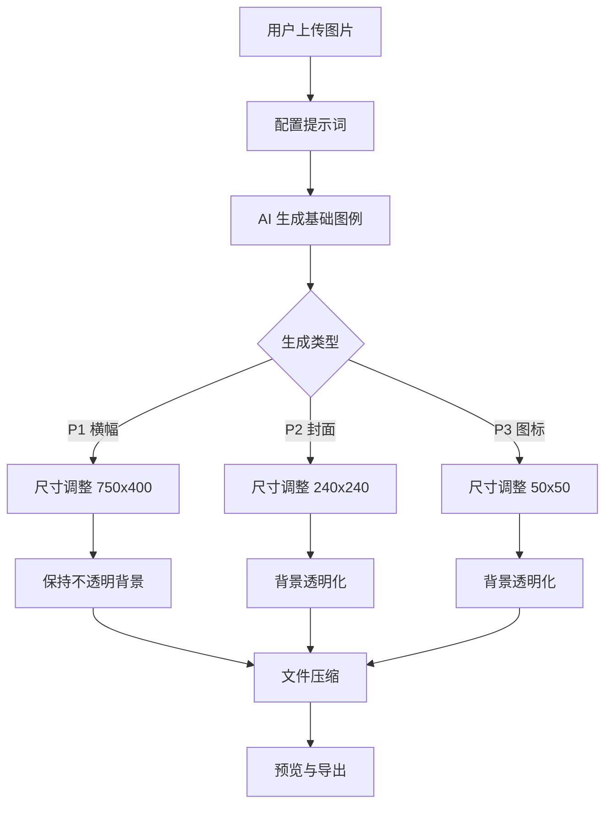
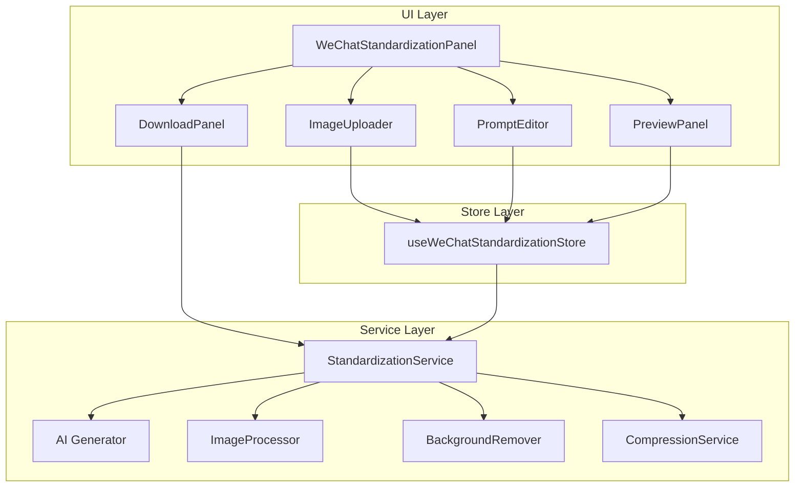

# Design Document: WeChat Sticker Standardization

## Overview

微信表情平台标准化模块是一个独立的功能模块，用于将用户上传的表情包图片转换为符合微信表情开放平台规范的三种标准格式。该模块支持多图上传、AI 辅助生成基础图例、传统图像处理（尺寸调整、背景透明化）以及结果预览与导出。

### 核心流程



### 微信表情平台规范

| 类型 | 名称 | 尺寸 | 格式 | 背景 | 大小限制 |
|------|------|------|------|------|----------|
| P1 | 详情页横幅 | 750×400 | JPG/PNG | 不透明 | ≤500KB |
| P2 | 表情封面图 | 240×240 | PNG | 透明 | ≤500KB |
| P3 | 聊天页图标 | 50×50 | PNG | 透明 | ≤100KB |

## Architecture

### 模块架构



### 技术选型

- **UI 框架**: React + TypeScript（与现有项目一致）
- **状态管理**: Zustand（与现有项目一致）
- **图像处理**: Canvas API + @imgly/background-removal
- **AI 生成**: 复用现有 aiService
- **文件打包**: JSZip（与现有项目一致）

## Components and Interfaces

### 1. WeChatStandardizationPanel

主面板组件，协调整个标准化工作流。

```typescript
interface WeChatStandardizationPanelProps {
  /** 从表情包生成模块导入的图片（可选） */
  importedEmojis?: ExtractedEmoji[];
  /** 关闭面板回调 */
  onClose?: () => void;
}
```

### 2. StandardizationImageUploader

多图上传组件，支持拖拽和点击上传。

```typescript
interface StandardizationImageUploaderProps {
  /** 已上传的图片列表 */
  images: SourceImage[];
  /** 上传回调 */
  onUpload: (files: File[]) => void;
  /** 删除回调 */
  onDelete: (id: string) => void;
  /** 最大上传数量 */
  maxCount?: number;
  /** 是否禁用 */
  disabled?: boolean;
}
```

### 3. StandardizationPromptEditor

提示词编辑组件，为 P1/P2/P3 分别提供编辑区域。

```typescript
interface StandardizationPromptEditorProps {
  /** P1 提示词 */
  p1Prompt: string;
  /** P2 提示词 */
  p2Prompt: string;
  /** P3 提示词 */
  p3Prompt: string;
  /** 提示词变更回调 */
  onPromptChange: (type: 'p1' | 'p2' | 'p3', value: string) => void;
  /** 重置回调 */
  onReset: (type: 'p1' | 'p2' | 'p3') => void;
}
```

### 4. StandardizationPreviewPanel

结果预览组件，展示处理后的 P1/P2/P3 图片。

```typescript
interface StandardizationPreviewPanelProps {
  /** P1 横幅预览 */
  p1Preview: ProcessedImage | null;
  /** P2 封面预览 */
  p2Preview: ProcessedImage | null;
  /** P3 图标预览 */
  p3Preview: ProcessedImage | null;
  /** 处理状态 */
  status: ProcessingStatus;
  /** 重新生成回调 */
  onRegenerate: (type: 'p1' | 'p2' | 'p3') => void;
}
```

### 5. StandardizationService

核心服务，协调 AI 生成和图像处理流程。

```typescript
interface StandardizationService {
  /** 生成 P1 横幅 */
  generateBanner(
    sourceImages: SourceImage[],
    prompt: string,
    apiConfig: APIConfig
  ): Promise<ProcessedImage>;
  
  /** 生成 P2 封面 */
  generateCover(
    sourceImages: SourceImage[],
    prompt: string,
    apiConfig: APIConfig
  ): Promise<ProcessedImage>;
  
  /** 生成 P3 图标 */
  generateIcon(
    sourceImages: SourceImage[],
    prompt: string,
    apiConfig: APIConfig
  ): Promise<ProcessedImage>;
  
  /** 批量生成所有类型 */
  generateAll(
    sourceImages: SourceImage[],
    prompts: StandardizationPrompts,
    apiConfig: APIConfig
  ): Promise<StandardizationResult>;
}
```

### 6. WeChatImageProcessor

图像处理服务，负责尺寸调整和格式转换。

```typescript
interface WeChatImageProcessor {
  /** 处理为 P1 横幅规格 */
  processToBanner(imageBlob: Blob): Promise<ProcessedImage>;
  
  /** 处理为 P2 封面规格 */
  processToCover(imageBlob: Blob): Promise<ProcessedImage>;
  
  /** 处理为 P3 图标规格 */
  processToIcon(imageBlob: Blob): Promise<ProcessedImage>;
  
  /** 调整图片尺寸（保持比例，居中裁剪） */
  resizeImage(
    imageBlob: Blob,
    targetWidth: number,
    targetHeight: number,
    options?: ResizeOptions
  ): Promise<Blob>;
  
  /** 压缩图片至指定大小 */
  compressImage(
    imageBlob: Blob,
    maxSizeKB: number,
    format: 'png' | 'jpeg'
  ): Promise<Blob>;
}
```

## Data Models

### SourceImage

用户上传的源图片。

```typescript
interface SourceImage {
  id: string;
  file: File;
  preview: string;  // base64 或 object URL
  uploadedAt: number;
}
```

### ProcessedImage

处理后的标准化图片。

```typescript
interface ProcessedImage {
  id: string;
  type: 'banner' | 'cover' | 'icon';
  blob: Blob;
  preview: string;
  width: number;
  height: number;
  sizeKB: number;
  format: 'png' | 'jpeg';
  hasTransparency: boolean;
}
```

### StandardizationPrompts

三种类型的提示词配置。

```typescript
interface StandardizationPrompts {
  p1: string;  // 横幅提示词
  p2: string;  // 封面提示词
  p3: string;  // 图标提示词
}
```

### StandardizationResult

标准化处理结果。

```typescript
interface StandardizationResult {
  banner: ProcessedImage | null;
  cover: ProcessedImage | null;
  icon: ProcessedImage | null;
  errors: StandardizationError[];
}
```

### ProcessingStatus

处理状态。

```typescript
type ProcessingStatus = 
  | { stage: 'idle' }
  | { stage: 'uploading'; progress: number }
  | { stage: 'generating'; type: 'p1' | 'p2' | 'p3'; progress: number }
  | { stage: 'processing'; type: 'p1' | 'p2' | 'p3' }
  | { stage: 'completed' }
  | { stage: 'error'; message: string };
```

### WeChatStandardizationState

Zustand Store 状态。

```typescript
interface WeChatStandardizationState {
  // 源图片
  sourceImages: SourceImage[];
  
  // 提示词
  prompts: StandardizationPrompts;
  
  // 处理结果
  result: StandardizationResult | null;
  
  // 处理状态
  status: ProcessingStatus;
  
  // Actions
  addSourceImages: (files: File[]) => void;
  removeSourceImage: (id: string) => void;
  clearSourceImages: () => void;
  importFromEmojis: (emojis: ExtractedEmoji[]) => void;
  
  setPrompt: (type: 'p1' | 'p2' | 'p3', value: string) => void;
  resetPrompt: (type: 'p1' | 'p2' | 'p3') => void;
  resetAllPrompts: () => void;
  
  startGeneration: () => Promise<void>;
  regenerate: (type: 'p1' | 'p2' | 'p3') => Promise<void>;
  cancelGeneration: () => void;
  
  reset: () => void;
}
```

### 默认提示词

```typescript
const DEFAULT_PROMPTS: StandardizationPrompts = {
  p1: `基于提供的表情包素材，创作一张微信表情详情页横幅图。
要求：
- 横幅构图，画面丰富有故事性
- 色调活泼明朗，与微信底色有较大区分
- 避免使用白色背景
- 图中避免出现任何文字信息
- 元素不能因拉伸或压扁导致变形
- 内容须与表情相关`,

  p2: `基于提供的表情包素材，创作一张微信表情封面图。
要求：
- 选取最具辨识度的形象
- 建议使用表情形象正面的半身像或全身像
- 避免只使用形象头部图片
- 画面尽量简洁，避免加入装饰元素
- 除纯文字类型表情外，避免出现文字
- 形象不应有白色描边，避免出现锯齿`,

  p3: `基于提供的表情包素材，创作一张微信聊天页图标。
要求：
- 选最具辨识度和清晰的图片
- 画面尽量简洁，避免加入装饰元素
- 建议使用仅含表情角色头部正面图像
- 形象不应有白色描边，避免出现锯齿
- 不要出现正方形边框
- 每张图片不应有过多留白`,
};
```

## Correctness Properties

*A property is a characteristic or behavior that should hold true across all valid executions of a system—essentially, a formal statement about what the system should do. Properties serve as the bridge between human-readable specifications and machine-verifiable correctness guarantees.*

### Property 1: File Format Validation

*For any* uploaded file, the Image_Uploader SHALL accept it if and only if its MIME type is one of 'image/png', 'image/jpeg', 'image/webp'.

**Validates: Requirements 1.2, 1.6**

### Property 2: Upload Count Limit

*For any* sequence of upload operations, the total number of source images SHALL never exceed 20. When the limit is reached, additional uploads SHALL be rejected.

**Validates: Requirements 1.3, 1.7**

### Property 3: Image Deletion Consistency

*For any* source image list and any valid image ID, after deletion the list length SHALL decrease by exactly 1 and the deleted image SHALL no longer be present.

**Validates: Requirements 1.5**

### Property 4: Prompt Reset Idempotence

*For any* prompt type (p1, p2, p3), resetting the prompt SHALL result in the prompt value being equal to the corresponding default prompt value.

**Validates: Requirements 2.6**

### Property 5: Image Size Standardization

*For any* input image processed by the Image_Processor:
- P1 Banner output SHALL have dimensions exactly 750×400 pixels
- P2 Cover output SHALL have dimensions exactly 240×240 pixels  
- P3 Icon output SHALL have dimensions exactly 50×50 pixels

**Validates: Requirements 4.1, 4.2, 4.3**

### Property 6: Aspect Ratio Preservation

*For any* input image, when resized to target dimensions, the Image_Processor SHALL maintain the original aspect ratio of the content (no stretching or squashing), using center-crop strategy when aspect ratios differ.

**Validates: Requirements 4.4, 4.5**

### Property 7: Output Format Compliance

*For any* processed image:
- P1 Banner SHALL be output as PNG or JPEG format
- P2 Cover SHALL be output as PNG format with alpha channel
- P3 Icon SHALL be output as PNG format with alpha channel

**Validates: Requirements 4.6, 4.7, 4.8**

### Property 8: Background Transparency

*For any* P2 Cover or P3 Icon image processed by Background_Remover, the output image SHALL contain transparent pixels (alpha < 255) in the background region.

**Validates: Requirements 5.1, 5.2, 5.3**

### Property 9: File Size Compression

*For any* processed image:
- P1 Banner file size SHALL be ≤ 500KB
- P2 Cover file size SHALL be ≤ 500KB
- P3 Icon file size SHALL be ≤ 100KB

**Validates: Requirements 6.6, 6.7, 6.8**

### Property 10: File Naming Convention

*For any* downloaded file, the filename SHALL follow the pattern:
- P1: 'banner_750x400.{png|jpg}'
- P2: 'cover_240x240.png'
- P3: 'icon_50x50.png'

**Validates: Requirements 6.5**

### Property 11: ZIP Package Contents

*For any* batch download operation, the resulting ZIP file SHALL contain exactly 3 files with the correct naming convention for P1, P2, and P3.

**Validates: Requirements 6.4**

## Error Handling

### 错误类型

```typescript
type StandardizationErrorType =
  | 'INVALID_FILE_FORMAT'      // 不支持的文件格式
  | 'FILE_TOO_LARGE'           // 文件过大
  | 'UPLOAD_LIMIT_EXCEEDED'    // 超过上传数量限制
  | 'AI_GENERATION_FAILED'     // AI 生成失败
  | 'IMAGE_PROCESSING_FAILED'  // 图像处理失败
  | 'BACKGROUND_REMOVAL_FAILED' // 背景移除失败
  | 'COMPRESSION_FAILED'       // 压缩失败
  | 'DOWNLOAD_FAILED';         // 下载失败

interface StandardizationError {
  type: StandardizationErrorType;
  message: string;
  details?: unknown;
}
```

### 错误处理策略

1. **文件格式错误**: 立即拒绝并显示支持的格式列表
2. **上传数量超限**: 提示用户删除部分图片后重试
3. **AI 生成失败**: 显示错误信息，允许重试或调整提示词
4. **图像处理失败**: 显示错误信息，允许重新上传源图片
5. **背景移除失败**: 回退到简单背景移除算法，或允许用户跳过
6. **压缩失败**: 尝试降低质量重新压缩，或提示用户手动处理
7. **下载失败**: 显示错误信息，允许重试

## Testing Strategy

### 单元测试

- 文件格式验证函数
- 图片尺寸调整函数
- 文件压缩函数
- 文件命名生成函数
- Store actions

### 属性测试

使用 fast-check 进行属性测试，每个属性测试至少运行 100 次迭代。

测试文件命名: `*.property.test.ts`

标签格式: `**Feature: wechat-sticker-standardization, Property {number}: {property_text}**`

### 集成测试

- 完整的标准化流程测试（mock AI 服务）
- 从表情包生成模块导入测试
- 批量下载功能测试

### 测试框架

- **单元测试**: Vitest
- **属性测试**: fast-check + Vitest
- **组件测试**: React Testing Library
